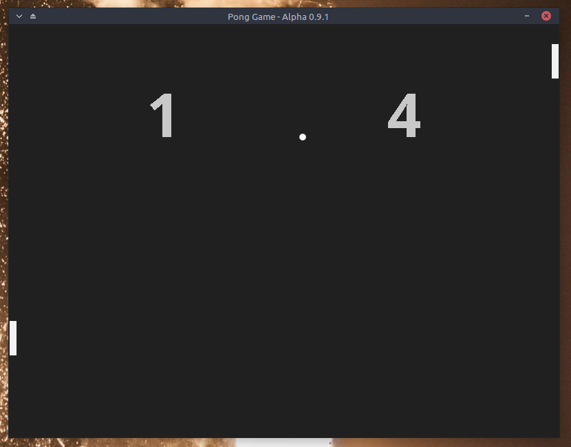

__Pong Game__
===

A remake of the __Pong Game__ of Atari(1972) with SDL2! The game has better graphics, but yet, is not so GOOD.    
**NOTE: This software is alpha, not all features are ready.**

*Q: What looks like to play Pong?*
*A: See with your eyes!*

__How to play?__

Player |     Keys    | Moviment
------ | ----------- | --------
One    |      W      |    Up
One    |      S      |   Down
Two    |  Up arrow   |    Up
Two    |  Down arrow |   Down

__There's also action keys!__

 Key  |      Action      |
------| -----------------|
 F11  |  Fullscreen mode
 ESC  |  Exit game
 F5   |  Debug mode
 P    |	 Pause game 
 R    |	 Reset game

This game was compiled in Linux with G++ and in Windows with MingW32, using the Qt and Code::Blocks, so you may have no problems with these IDEs. If you have any issue with the compiler saying that to_string is not a member of std you problaby is not compiling with -std=c++11 or you are compiling with MingW32 that has this _[problem](https://gcc.gnu.org/bugzilla/show_bug.cgi?id=52015)! But is easy to solve, so good luck!

You do <b>need</b> of:
  * [SDL2](http://www.libsdl.org/download-2.0.php)
  * [SDL2 Image](https://www.libsdl.org/projects/SDL_image/)
  * [SDL2 TTF](https://www.libsdl.org/projects/SDL_ttf/)

<b>Remind:</b> The res folder has to be on the same folder as the *.exe , otherwise, it will give you a segmentation fault, or you can change the path to the images and fonts in the main.cpp and recompile the game. If you are having problems executing the game is probably because you don't have the runtime libraries of the SDL2, SDL2_image, SDL2_ttf, so just look at the links above and download them.

This project is licensee on __[Apache v2](http://www.apache.org/licenses/LICENSE-2.0.html)__!

===
<b>Roadmap:</b>
  - [ ] __Perfect__ collision detection.
  - [X] Over each match of the game, a random direction for the ball.
  - [x] Ball speed increases over the course of hits in the paddles.
  - [X] Pause game

===
Contributors
 * Me (Rafael Campos Nunes).
